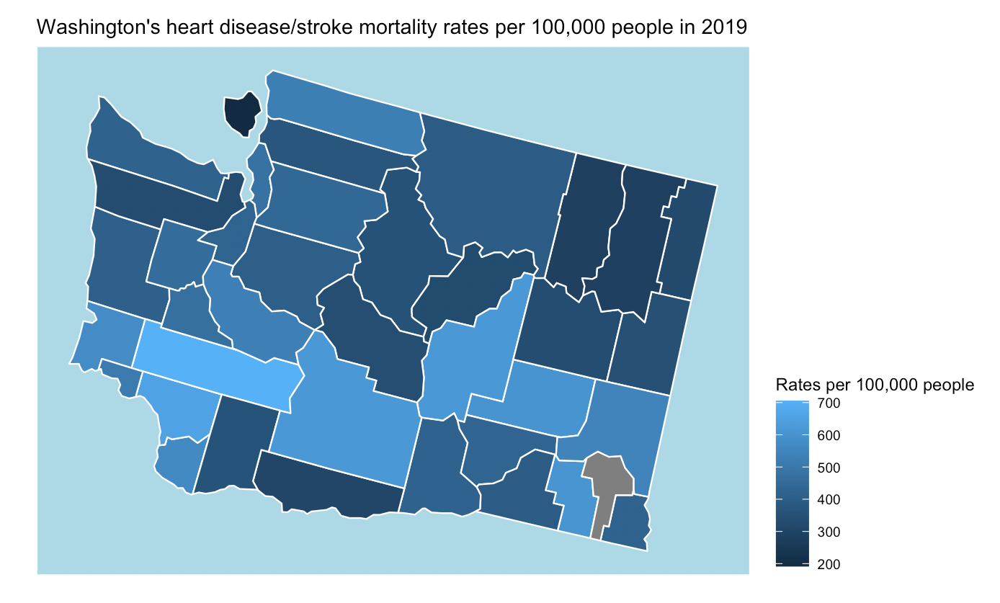

# Summary

In this summary, we analyzed different aspects of the CDC data to analyse any disparities and inequalities that may exist in cardiovascular disease rates. Here are some key takeaways to the data in relation to Washington data. 

## County Rates
Looking at the county rates in different states can reveal some 

## Yearly trends 

## Racial Trends

