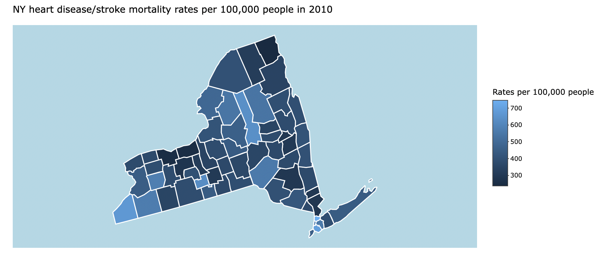
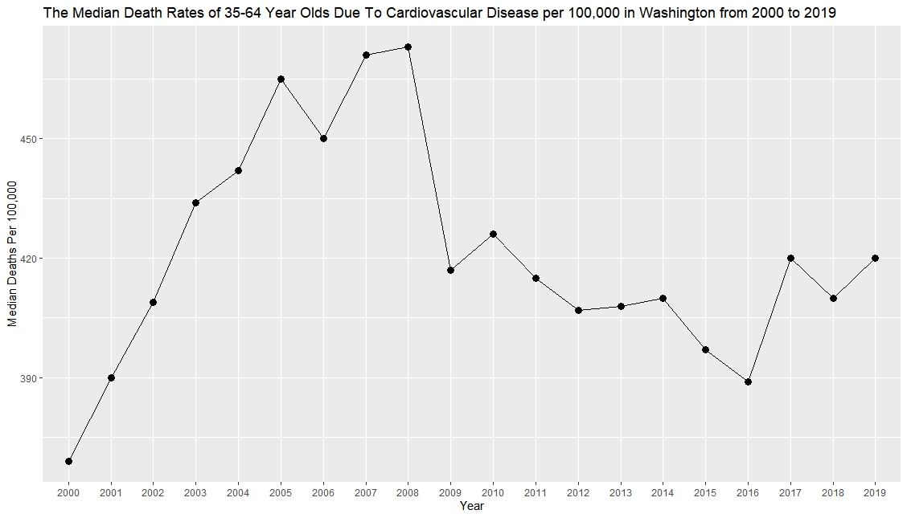
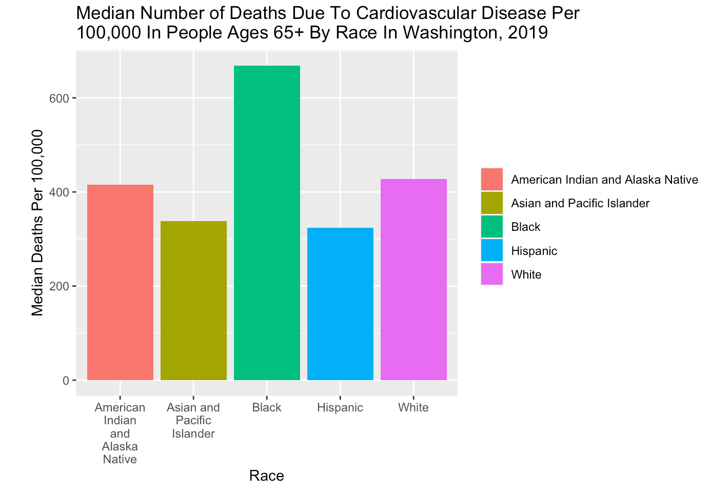

# Summary

In this summary, we analyzed different aspects of the CDC data to analyse any disparities and inequalities that may exist in cardiovascular disease rates. Here are some key takeaways to the data in relation to Washington data. 

## County Rates
One takeaway from the map is that location of where the counties with the highest and lowest rate most likely vary for each state more than originally expected where the highest income per capita correlates to the lowest cardiovascular disease and stroke mortality rates and vice versa. For example, in New York in 2010, the county with the highest rate was the Bronx. The Bronx indeed holds the title for the lowest income per capita in New York, which may reflect on the health inequalities and disparities surrounding having a low income, but the lowest rate was not New York county, which holds the title for the highest income per capita in New York, but Clinton county, which is far from that title. While this map might not surely reveal common connections between the income per capita and cardiovascular disease and stroke mortality rates, we suggest possibly researching specific areas and cities within a given county to investigate wealth inequalities as well as other potential factors such as poverty rates.

## Yearly trends 
One of the takeaways from this chart is the change in death rate varies significantly based on location and age. For
example, if we were to investigate the change in death rates for 35 to 64 year olds, we would usually see a small gradual increase in the death rate over the years. But if we were to investigate 65 plus year olds, we would see a lot of fluctuation over the years and see that despite there being large drops and increases over the years, the difference between the death rates from only 2000 and only 2019 are not that far apart. Washington state is a great example of this exact thing because both graphs, and a large amount of others, follow what I pointed out. Washington's death rate hit an all time high in 2008 and decreased significantly up until 2016, where it slightly increased and stayed around the same point for the next few years. Overall, recognizing how the death rates changes over time and the things we can do to prevent such dramatic rates is important. Additionally, understanding this change exists is important because we can notice irregularities of the sudden increases and decreases and investigate if there were any social or economic inequalities within the actions that causes these fluctuations. 

## Racial Trends

