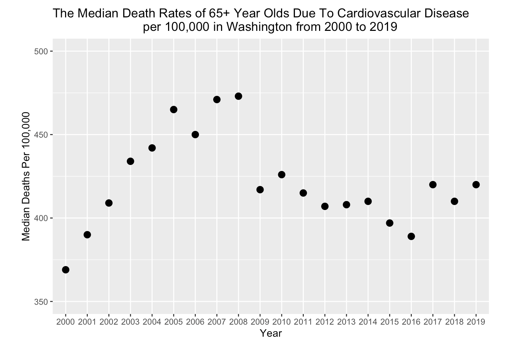

# Summary

In this summary, we analyzed different aspects of the CDC data to analyse any disparities and inequalities that may exist in cardiovascular disease rates. Here are some key takeaways to the data in relation to Washington data. 

## County Rates
One takeaway from the map is that location of where the counties with the highest and lowest rate most likely vary for each state more than originally expected where the highest income per capita correlates to the lowest cardiovascular disease and stroke mortality rates and vice versa. For example, in New York in 2010, the county with the highest rate was the Bronx. The Bronx indeed holds the title for the lowest income per capita in New York, which may reflect on the health inequalities and disparities surrounding having a low income, but the lowest rate was not New York county, which holds the title for the highest income per capita in New York, but Clinton county, which is far from that title. While this map might not surely reveal common connections between the income per capita and cardiovascular disease and stroke mortality rates, we suggest possibly researching specific areas and cities within a given county to investigate wealth inequalities as well as other potential factors such as poverty rates.

## Yearly trends 

## Racial Trends

